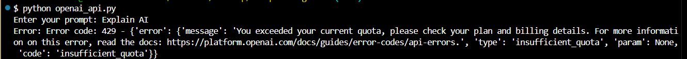
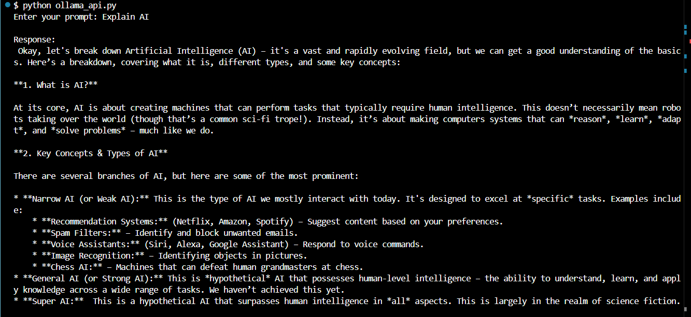
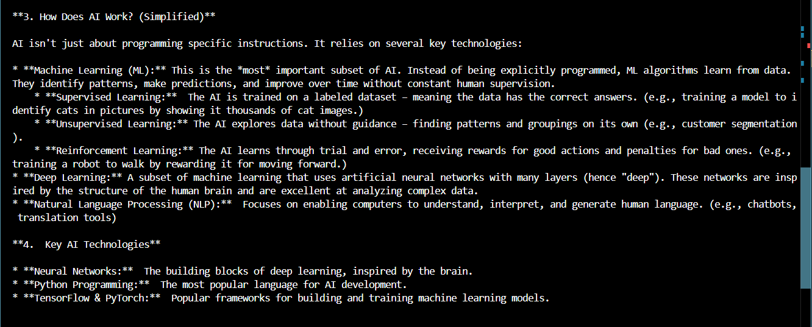
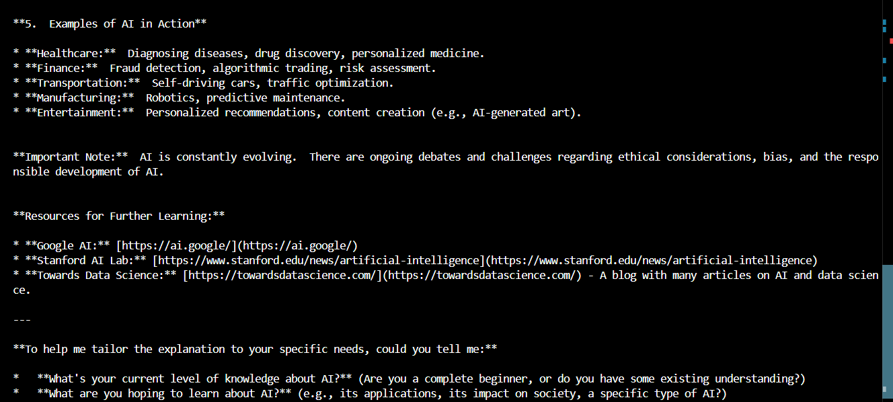
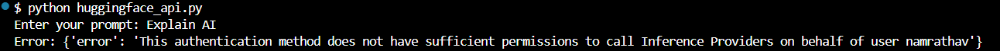
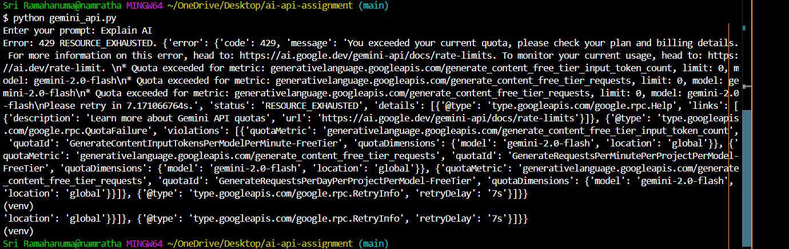

# AI API Integrations Project

This project demonstrates integration with multiple AI providers using Python.

## APIs Covered
- OpenAI
- Groq
- Ollama (Local)
- Hugging Face
- Google Gemini
- Cohere

## Features
- Accepts user input
- Sends request to API
- Displays response
- Handles errors properly
- Uses environment variables for API keys

## Setup Instructions

1. Clone the repository:
   git clone <your-repo-link>

2. Navigate to project:
   cd ai-api-integrations

3. Create virtual environment:
   python -m venv venv
   source venv/Scripts/activate

4. Install dependencies:
   pip install -r requirements.txt

5. Set environment variables:
   - OPENAI_API_KEY
   - GROQ_API_KEY
   - HF_API_KEY
   - GEMINI_API_KEY
   - COHERE_API_KEY

## Run Examples

python openai_api.py
python groq_api.py
python ollama_api.py
python huggingface_api.py
python gemini_api.py
python cohere_api.py

## Notes
- Ollama runs locally (no API key required)
- Ensure Ollama is running before executing ollama_api.py

## Screenshots

### OpenAI Output
OpenAI API returned quota exceeded error (429).
Handled gracefully in the program.

### Groq Output

### Ollama Output

### Hugging Face Output

Note: Hugging Face API access is restricted for this account.

Error handled:
"This authentication method does not have sufficient permissions..."

This demonstrates proper error handling for API permission issues.

### Gemini Output
Handled quota exceeded error gracefully

### Cohere Output
